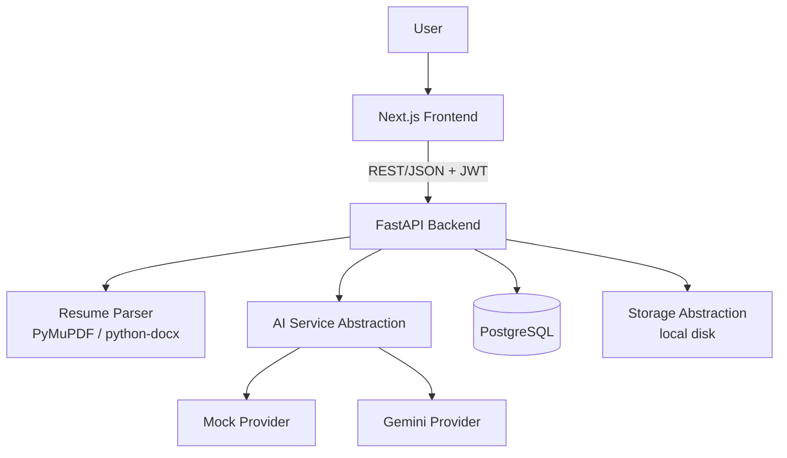

# AI Resume Analyzer & Job Matching Platform

> An AI-powered full-stack platform that parses resumes, scores them, compares them against job descriptions, surfaces skill gaps, and helps track job applications end to end.

## Overview

This project helps job seekers understand exactly where their resume stands and what to improve before applying. Upload a resume (PDF/DOCX), get an AI-generated score across skills, experience, projects, and structure, paste a job description to see a match score with matched/missing/partial skills, and track every application from "saved" to "offer" in one dashboard.

It's built as a portfolio project demonstrating a realistic, production-style full-stack architecture — not a toy demo — with a Python/FastAPI backend, a Next.js frontend, a real Postgres schema, and a swappable AI provider abstraction that runs entirely offline via a mock mode.

## Key Features

- User authentication (JWT, bcrypt password hashing)
- Resume upload (PDF/DOCX) with server-side validation and parsing
- Resume text extraction and structured field parsing (name, contact info, skills, education, experience, projects, certifications, achievements, languages, links)
- AI-powered resume scoring (overall, skills, experience, projects, education, structure, achievements, keywords, job relevance) with strengths/weaknesses/recommendations
- Resume analysis history (each run is kept, not overwritten)
- Job description analysis (required/preferred skills, experience requirement, education requirement, keyword extraction)
- Resume-to-job matching with matched/missing/partial skill breakdown and a numeric match score
- Job application tracker (status pipeline: saved → applied → interview → technical round → offer / rejected / withdrawn) with notes, dates, and job URLs
- Dashboard with aggregate stats (applications, interviews, offers, pending) and per-resume score visualizations (bars + radar chart)
- Editable user profile (name, location, GitHub/LinkedIn/portfolio links, preferred role)
- Swappable AI provider (mock — no API key needed — or Google Gemini) and swappable storage backend (local disk, structured for S3/Supabase later)

## Tech Stack

| Category | Technology |
|---|---|
| Frontend | Next.js 16 (App Router), TypeScript, Tailwind CSS 4, Recharts, Lucide React |
| Backend | Python 3.11+, FastAPI, Pydantic |
| Database | PostgreSQL |
| ORM / Migrations | SQLAlchemy 2.0, Alembic |
| AI | Google Gemini (`google-genai`), or a built-in mock provider |
| Resume Processing | PyMuPDF (PDF), python-docx (DOCX) |
| Authentication | JWT (PyJWT) + bcrypt password hashing |
| Testing | Pytest (backend, 59 tests), Vitest + React Testing Library (frontend) |
| Deployment | Not yet configured — local development only |

## Architecture



The frontend never talks to the database or the AI provider directly — every interaction goes through the FastAPI REST API. See `frontend/lib/api.ts` for the single typed client every page uses.

## Project Structure

```text
AI Resume Analyzer/
├── backend/
│   ├── app/
│   │   ├── api/          # FastAPI routers (auth, resumes, jobs, matching, applications, dashboard)
│   │   ├── models/       # SQLAlchemy ORM models
│   │   ├── schemas/      # Pydantic request/response schemas
│   │   ├── services/     # Business logic (parser, AI, matching, storage, auth)
│   │   ├── database/     # DB engine/session setup
│   │   └── main.py       # FastAPI app entrypoint
│   ├── alembic/          # Database migrations
│   ├── tests/            # Pytest suite + sample fixtures
│   └── requirements.txt
├── frontend/
│   ├── app/              # Next.js routes (landing, auth, dashboard, resumes, jobs, applications, profile, about)
│   ├── components/       # UI, layout, and feature components
│   ├── lib/              # API client, auth context, utilities
│   └── types/            # TypeScript interfaces mirroring backend schemas
├── README.md
└── DOCUMENTATION.md
```

## Getting Started

### Clone

```bash
git clone <repository-url>
cd "AI Resume Analyzer"
```

### Database (PostgreSQL)

Create a local database (see [DOCUMENTATION.md](DOCUMENTATION.md#19-local-development-setup) for full options including Docker):

```sql
CREATE ROLE resume_user WITH LOGIN PASSWORD 'resume_pass' CREATEDB;
CREATE DATABASE resume_analyzer OWNER resume_user;
```

### Backend

```bash
cd backend
python -m venv venv
```

Windows:

```bash
venv\Scripts\activate
```

Then:

```bash
pip install -r requirements.txt
cp .env.example .env
alembic upgrade head
uvicorn app.main:app --reload
```

API: http://localhost:8000 — interactive docs at http://localhost:8000/docs

### Frontend

```bash
cd frontend
npm install
cp .env.local.example .env.local
npm run dev
```

App: http://localhost:3000

## Environment Variables

Secrets are stored in `.env` files (gitignored) — never commit real values. See `.env.example` in each folder.

**Backend** (`backend/.env`):

```env
DATABASE_URL=
JWT_SECRET_KEY=
AI_MODE=
AI_PROVIDER=
GEMINI_API_KEY=
```

**Frontend** (`frontend/.env.local`):

```env
NEXT_PUBLIC_API_URL=
```

`AI_MODE=mock` (the default) needs no API key at all — the whole app runs and is demoable without one.

## Screenshots

TODO — add screenshots of the landing page, dashboard, resume analysis view, and application tracker before sharing this project publicly.

## API Overview

```text
Authentication   /api/auth/*
Resumes          /api/resumes/*
Jobs             /api/jobs/*
Matching         /api/matching/*
Applications     /api/applications/*
Dashboard        /api/dashboard
```

See [DOCUMENTATION.md](DOCUMENTATION.md#17-api-documentation) for the full endpoint reference with request/response examples.

## Future Improvements

- AI-powered resume improvement suggestions (rewrite weak bullet points)
- Additional AI providers (OpenAI, local LLMs)
- Cloud storage backend (S3 / Supabase Storage)
- Multiple resume versions compared side by side
- Job board integrations (auto-import job descriptions from a URL)
- Email notifications for application follow-ups
- Deployment configuration (currently local-only)

## License

TODO — no license has been selected yet.
